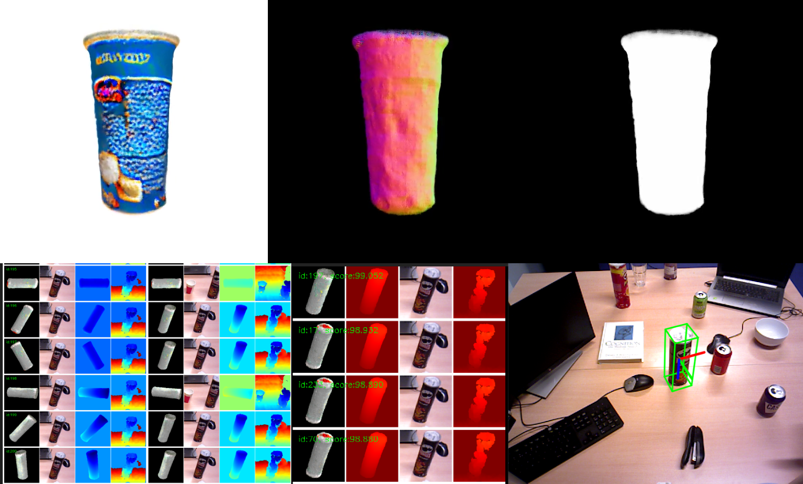
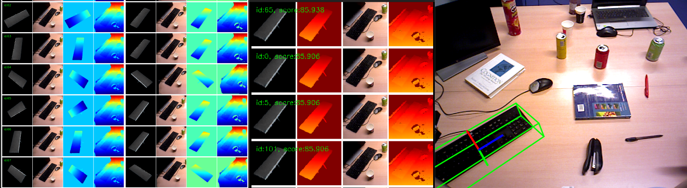
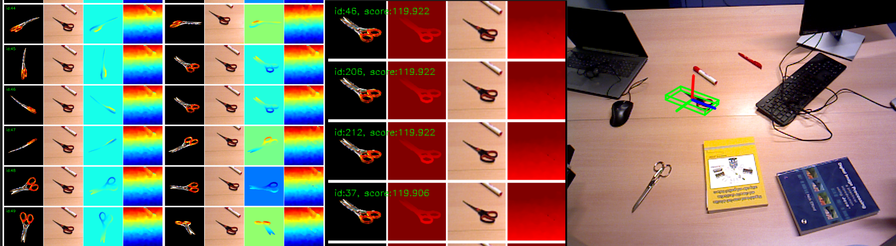

# 6D Pose Estimation of Novel Objects

## Using AI-Generated Meshes & FoundationPose



**FoundationPose** is a state-of-the-art 6D object pose estimator that, given an RGB image, depth map, object mask, camera intrinsics, and a 3D model, generates and refines pose hypotheses to accurately recover an object’s 3D position and orientation.

**ThreeStudio** leverages diffusion-based 3D generative AI (Zero123, Magic123, DreamFusion) to reconstruct coarse meshes from single-view images or prompts, enabling pose estimation pipelines to handle missing or incomplete CAD data.

Together, this repository integrates FoundationPose and ThreeStudio to form a unified pipeline that:

* Automatically generates or augments 3D meshes for novel objects
* Performs end-to-end 6D pose inference and evaluation on both LINEMOD-style and HOTS-style datasets
* Provides visualization, quantitative metrics (ADD, IoU, Chamfer, etc.), and scale-aware alignment

---

# Media Demonstrations

Below are some demo recordings and key visualizations generated by our pipeline. You can find all media files in the `assets/` folder.

### Apple (DreamFusion)

<video width="480" controls src="assets/apple_dreamfusion.gif">
Your browser does not support the video tag.
</video>

### Cat (Magic123)

<video width="480" controls src="assets/cat_magic123.gif">
Your browser does not support the video tag.
</video>

### Keyboard (Zero123)

<video width="480" controls src="assets/keyboard_zero123.gif">
Your browser does not support the video tag.
</video>

### FoundationPose Examples


*Figure: Hypotheses → Refiner → Scorer on a keyboard object.*


*Figure: Hypotheses → Refiner → Scorer on a scissors object.*

---

# FoundationPose x ThreeStudio: Thesis Pipeline

This repository implements a unified 6D object pose estimation pipeline using **FoundationPose** and **ThreeStudio**, capable of handling incomplete datasets by automatically generating 3D meshes and running end-to-end inference and evaluation. It supports both **LINEMOD-style** and **demo-style** datasets, includes visualization, quantitative evaluation, and scale-aware 3D alignment.

---

## Overview

This repository contains:

* Complete setup for running **FoundationPose** inference
* Integrated 3D mesh generation using **ThreeStudio** when missing
* Modular pipelines for:

  * HOTS dataset processing and inference
  * Linemod 3D mesh corruption and error analysis
  * Pose evaluation with multiple metrics (ADD, IoU, Chamfer, etc.)
* HPC and local development support (Docker + Conda)

---

## Setup Instructions

### Step 1: Install Docker and Add User Permissions

```bash
sudo apt install docker.io
sudo apt install nvidia-container-toolkit
sudo usermod -aG docker $USER
newgrp docker
```

### Step 2: Clone Repository and Create Environment

```bash
git clone https://github.com/JustinLungu/FoundationPose-BachelorThesis.git
cd FoundationPose-BachelorThesis
conda env create -f environment.yml
# or use pip:
pip install -r requirements.txt
```

### Step 3: Download All Required Data and Codebases

```bash
python populate_pipelines.py
```

This downloads:

* Processed HOTS data
* FoundationPose internal zips
* Linemod noisy mesh data
* ThreeStudio + pretrained weights

### Step 4: Build Project Images

```bash
./build_project.sh
```

Builds both `threestudio_custom` and `foundationpose-with-docker` Docker images.

### Step 5: Run the Project

```bash
./run_project.sh
```

This opens the FoundationPose container and links it to ThreeStudio. Visualizations, results, and intermediate stages are written outside the container.

---

## Recommended Workflow

| Task                            | Run Inside Docker | Run Outside Docker |
| ------------------------------- | ----------------- | ------------------ |
| FoundationPose inference        | Yes               | No                 |
| Threestudio generation          | Yes               | No                 |
| Preprocessing HOTS or Linemod   | No                | Yes                |
| Evaluation scripts and plotting | No                | Yes                |

---

## Directory Highlights

| Path                          | Purpose                                                  |
| ----------------------------- | -------------------------------------------------------- |
| `Pipelines/Process_HOTS/`     | Converts HOTS → Linemod/Demo and runs FoundationPose     |
| `Pipelines/Linemod_3D_noise/` | Corrupts Linemod meshes and evaluates robustness         |
| `Pipelines/Pose_Eval`         | Runs evaluation metrics and plots with custom thresholds |
| `threestudio/`                | Localized 3D mesh generation backend                     |
| `FoundationPose/`             | Modified FoundationPose setup with Docker wrapper        |

---

## Key Scripts

| Script                  | Description                                                 |
| ----------------------- | ----------------------------------------------------------- |
| `populate_pipelines.py` | Downloads and unpacks all required zips from Google Drive   |
| `build_project.sh`      | Builds Docker images for Threestudio and FoundationPose     |
| `run_project.sh`        | Starts the FoundationPose container linked with ThreeStudio |

---

## Notes

* All metrics, paths, and settings can be configured in their respective `config.py` files
* FoundationPose visualizations follow red (GT) vs green (prediction) convention
* Threestudio-generated meshes are placed automatically if GT mesh is missing

---

© 2025 – Bachelor Thesis Pipeline by Iustin Lungu
